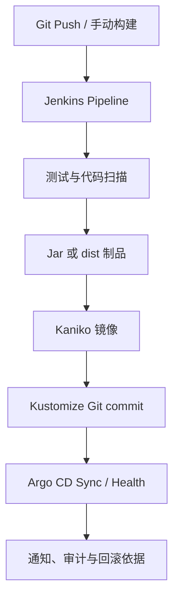

# Jenkins + Argo CD CI/CD 知识体系

本目录沉淀一套已经在实际项目中迭代验证的 CI/CD 方法：Jenkins 负责源码检出、编译、扫描、制品和镜像；Kustomize Git 保存部署期望状态；Argo CD 负责同步、漂移检测与 Kubernetes 资源健康判断。

内容不是功能清单，而是按照“旧方案问题 → 根因 → 设计取舍 → Shared Library/Jenkinsfile 实现 → 验证与回滚 → 可复用结论”组织，主要用于故障查阅、新项目接入和面试复盘。

> 公开版本已对地址、项目、应用和凭据标识进行脱敏；示例不能未经验证直接用于生产。

## 当前交付链

核心边界：

- Jenkins 不直接把一次 `kubectl` 脚本执行结果当成部署事实。
- `Synced` 表示期望状态已应用，`Healthy` 表示 Kubernetes 资源健康，业务正确还需冒烟验证。
- Jenkinsfile 保留项目差异和 Stage 编排，Shared Library 封装通用执行、校验和失败语义。
- 同一 Job 的并发与跨 Job 共享 GitOps 仓库的并发是两类问题，分别使用 `disableConcurrentBuilds()` 和全局 `lock()`。

## 文档导航

| 文档 | 重点内容 | 适合什么时候看 |
|---|---|---|
| [01 架构演进与 Pipeline 执行模型](01-architecture-and-pipeline-model.md) | 初始方案对比、职责边界、Jenkinsfile/Library 分层、`steps`、闭包、CPS、初始化、Agent、Git 检出 | 理解整体设计或解释代码原理 |
| [02 普通 Java 与单仓多服务流水线](02-java-pipelines.md) | Maven 日志、Sonar、全 Reactor 编译、服务选择、Jar 唯一校验、最小 Kaniko Context、失败语义 | 接入 Java 项目或排查多模块构建 |
| [03 前端流水线与 Kaniko](03-frontend-and-kaniko.md) | pnpm、Node/OpenSSL、dist 契约、Nginx、前端 Sonar、Registry 鉴权 | 接入 Vue 项目或处理构建成功但制品错误 |
| [04 Kustomize、Argo CD 与并发控制](04-gitops-kustomize-argocd-locking.md) | GitOps 更新事务、锁边界、Sync/Health、权限、回滚 | 排查 push 冲突、Argo Degraded 或并发问题 |
| [05 通知、可追溯性与故障排查 Runbook](05-observability-and-troubleshooting.md) | 日志/通知、12 类真实故障、接入 Runbook、15 分钟处置流程、常用命令 | 出现发布故障时快速查阅 |
| [06 知识模型、改进路线与面试复盘](06-knowledge-roadmap-and-interview.md) | 工程原则、下一阶段路线、STAR 表达、API 速查、Jenkinsfile 骨架 | 阶段复盘、面试准备或规划改进 |

## 已落地能力

| 能力 | 当前结论 |
|---|---|
| 分支与环境 | 一个项目一个 Job；`master -> test`、`release -> stage`，Webhook 与手动入口统一归一化 |
| 普通 Java | Maven、Sonar、日志归档、Kaniko、Kustomize、Argo CD 等待 |
| Java 多服务 | 根 POM 全量编译，参数只控制镜像与发布集合；逐服务校验并按顺序发布 |
| 前端 | Node/pnpm 独立构建，dist 打包后交给 Kaniko，兼容旧依赖并保留完整日志 |
| 可追溯性 | 源码 commit、制品、镜像 Tag、Kustomize commit、Argo 状态形成交付链 |
| 并发治理 | 同 Job 禁并发；跨 Job 对共享 GitOps 写事务使用 Controller 全局锁 |
| 通知 | 成功/失败均保留构建任务、日志和 Argo 摘要；通知失败不篡改部署事实 |

## 快速定位

| 现象 | 优先判断 | 对应章节 |
|---|---|---|
| Webhook 发布到错误环境 | 分支来源优先级与初始化 Map | 01 第 5 章 |
| 宿主机可 clone，Agent 子模块失败 | 实际 URL、凭据模型、`insteadOf` 生效作用域 | 01 第 7 章、05 第 16.2 节 |
| Maven 成功但 Jar 匹配不确定 | Jar 通配规则、唯一性与元数据文件 | 02 第 9 章 |
| `spawn vite ENOENT` | pnpm 依赖提升、脚本解析与本地 CLI 可见性 | 03 第 10.4 节 |
| Node 22/OpenSSL 报错 | 旧 Webpack 与 OpenSSL 3 兼容 | 03 第 10.5 节 |
| 构建退出 0，但出现 `dist/undefined` | 构建变量与制品语义校验 | 03 第 10.9/10.15 节 |
| Kustomize push non-fast-forward | 锁是否覆盖 fresh clone 到 push 的完整事务 | 04 第 12/14 章 |
| Argo `Synced` 但 `Degraded` | 从制品、镜像下钻到 Deployment、事件和日志 | 04 第 13 章、05 第 16.11 节 |

## 当前边界

- 测试与预上线已经落地，生产 promotion、Sync Window 和 Argo Rollouts 仍是下一阶段。
- 多服务发布不是数据库事务，当前不会自动整体回滚。
- Lockable Resources 只在单 Jenkins Controller 范围内全局有效。
- 旧前端的 `--shamefully-hoist` 和 OpenSSL legacy provider 是过渡兼容，不应成为新项目默认值。
- 下一轮优先补齐前端制品语义校验、多服务状态聚合、Argo revision 精确关联和 Shared Library 自动测试。
